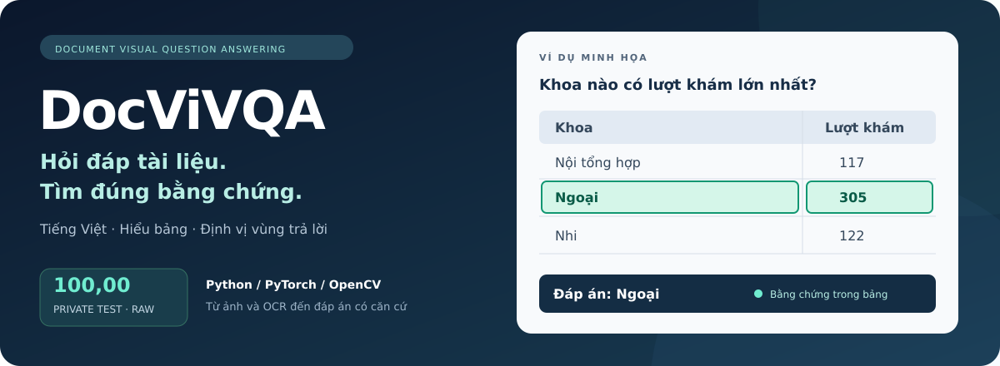
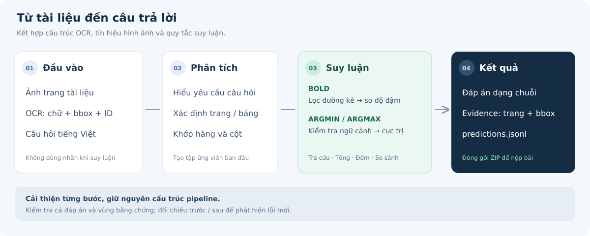

<h1 align="center">📄 DocViVQA</h1>

<p align="center">
  <strong>Hỏi đáp trên ảnh tài liệu tiếng Việt, kèm vùng bằng chứng.</strong><br>
  Hiểu cấu trúc bảng · Nhận diện chữ in đậm · Trả lời có căn cứ
</p>

<p align="center">
  
  
  
  
  
</p>



<p align="center">
  <a href="#overview">Tổng quan</a> ·
  <a href="#results">Kết quả</a> ·
  <a href="#quick-start">Bắt đầu</a> ·
  <a href="#documentation">Tài liệu</a>
</p>

Từ một ảnh tài liệu và câu hỏi, hệ thống xác định thông tin cần tìm, trả lời và chỉ ra vị trí chứng minh trên trang. Dự án phát triển từ baseline của cuộc thi, tập trung cải thiện **nhận diện chữ in đậm**, **Argmin/Argmax** và **định vị bằng chứng**.

<a id="overview"></a>

## 🔎 Tổng quan



### Những câu hỏi hệ thống xử lý

Các câu dưới đây minh họa loại yêu cầu; khi chạy cần chỉ rõ bảng, trang và điều kiện theo dữ liệu.

| Nhóm | Chức năng | Ví dụ yêu cầu |
|---|---|---|
| 🔍 Lookup | Truy xuất giá trị trong ô | Hiện có của phòng Công nghệ là bao nhiêu? |
| 🔢 Count | Đếm hàng thỏa điều kiện | Có bao nhiêu dòng có cây trồng là Lúa? |
| ➕ Sum / Cross-page Sum | Cộng giá trị trong bảng hoặc qua nhiều trang | Tổng lượt khám của một khoa ở hai trang là bao nhiêu? |
| ⚖️ Compare | So sánh hai hàng | Giữa Kinh doanh và Kế toán, phòng nào tuyển mới nhiều hơn? |
| 📊 Argmin / Argmax | Chọn hàng có giá trị nhỏ/lớn nhất | Khoa nào có lượt khám lớn nhất? |
| 🖋️ Visual Bold Lookup | Tra cứu theo hàng in đậm | Trong hai hàng được chỉ định, giá trị ở hàng in đậm là gì? |

### ✨ Các cải tiến chính

| Thành phần | Cách cải thiện |
|---|---|
| **Visual Bold Lookup** | Loại đường kẻ bảng trước khi đo độ dày nét; giữ ResNet18 làm phương án dự phòng. |
| **Argmin / Argmax** | Xử lý ô tên gộp; kiểm tra ngữ cảnh đủ và duy nhất trước khi chọn hàng có giá trị cực trị. |
| **Evidence** | Xét cả những hàng thiếu số khi xác định các ô cần thiết để phân biệt hàng trả lời. |

Mã suy luận sử dụng câu hỏi, ảnh và OCR; nhãn và chú giải chỉ phục vụ huấn luyện, đánh giá hoặc phân tích lỗi.

## 🧰 Công nghệ sử dụng

| Thành phần | Công nghệ / Cách xử lý |
|---|---|
| Ngôn ngữ &amp; môi trường | Python, Jupyter Notebook, Google Colab |
| Dữ liệu và ảnh | JSONL, NumPy, Pillow, OpenCV |
| Nhận diện Bold | Xử lý ảnh và độ dày nét; PyTorch / torchvision ResNet18 dự phòng |
| Suy luận bảng | Quy tắc phân tích câu hỏi, OCR bbox và quan hệ hàng/cột |
| Đầu ra | JSONL gồm đáp án và evidence; đóng gói ZIP |
| Kiểm tra | Self-test trong notebook, kiểm tra dataset và cấu trúc submission |

<a id="results"></a>

## 📈 Kết quả

| Phiên bản | Điểm raw trên private |
|---|---:|
| Baseline của tác giả | 94,99 |
| Cải thiện Bold | 95,82 |
| Bổ sung sửa evidence | 95,84 |
| Cải thiện xử lý hàng và ngữ cảnh Argmin/Argmax | 98,35 |
| Phiên bản hiện tại | **100,00** |

Các mốc phản ánh kết quả các phiên bản, không phải mọi mốc đều chỉ thay đổi một yếu tố. Trên 11.000 câu training, phiên bản hiện tại đạt ANLS và Evidence-F1 bằng 100%. Training đã được dùng để phân tích và chọn quy tắc; kết quả này là đánh giá hồi cứu. Khả năng tổng quát trên dữ liệu ngoài cuộc thi cần được kiểm tra thêm.

<a id="quick-start"></a>

## 🚀 Bắt đầu

### 1. Chuẩn bị môi trường

Cần Python và Git. Môi trường local đã kiểm chứng dùng **Python 3.12**. Có thể clone repository hoặc chọn **Code → Download ZIP** trên GitHub và giải nén.

```bash
git clone https://github.com/AIVIETNAM-AIO-LeWann/docvivqa.git
cd docvivqa
```

Chạy các lệnh từ thư mục gốc `docvivqa`.

<details>
<summary><strong>🪟 Windows — PowerShell</strong></summary>

```powershell
py -m venv .venv
.\.venv\Scripts\python.exe -m pip install torch torchvision opencv-python numpy pillow jupyter
.\.venv\Scripts\Activate.ps1
```

Nếu PowerShell không cho chạy script kích hoạt, thay `python` trong các lệnh bên dưới bằng `.\.venv\Scripts\python.exe`.

</details>

<details open>
<summary><strong>🐧 Linux / macOS</strong></summary>

```bash
python3 -m venv .venv
source .venv/bin/activate
python -m pip install torch torchvision opencv-python numpy pillow jupyter
```

</details>

### Chọn cách làm việc

| Nhu cầu | Bắt đầu từ |
|---|---|
| Xem từng bước suy luận | [Notebook pipeline](notebooks/submission_pipeline_context_structure.ipynb) |
| Chạy suy luận từ terminal | `python scripts/run_pipeline.py --split private_test --out outputs/private` |
| Train checkpoint tại máy | [Notebook train local](notebooks/train_bold_pair_local.ipynb) |
| Train checkpoint trên Colab | [Notebook train Colab](notebooks/train_bold_pair_colab.ipynb) |

### 2. Chuẩn bị dữ liệu và checkpoint

Dataset: [TACVU2 / DocViVQA trên Hugging Face](https://huggingface.co/datasets/lequangaio070206/tacvu2-docvivqa).

Giữ nguyên đường dẫn ảnh và OCR trong từng split:

```text
data/
├── training_set/
├── public_test/
└── private_test/
artifacts/models/
└── bold_pair_resnet18.pt
```

| File / Thư mục | Nội dung | Split |
|---|---|---|
| `manifest.jsonl` | Thông tin tài liệu và đường dẫn tài nguyên | Tất cả |
| `questions.jsonl` | Câu hỏi và mã câu hỏi | Tất cả |
| `ocr/` | Nội dung OCR, ID ô và bbox | Tất cả |
| `images/` | Ảnh các trang tài liệu | Tất cả |
| `labels.jsonl` | Đáp án chuẩn và vùng bằng chứng | Training |
| `cell_annotations.jsonl` | Chú giải ô bảng, phục vụ phân tích/huấn luyện | Training |

Chuẩn bị riêng dữ liệu của vòng thi cần chạy; quyền truy cập dataset phụ thuộc cấu hình trên Hugging Face. Giữ nguyên cấu trúc đường dẫn trong manifest.

Đặt checkpoint đã train vào đường dẫn trên. Nếu chưa có, sử dụng [notebook train local](notebooks/train_bold_pair_local.ipynb) hoặc [notebook train Colab](notebooks/train_bold_pair_colab.ipynb). Dữ liệu và checkpoint không được lưu trong Git.

### 3. Chạy pipeline

Mở [notebook suy luận](notebooks/submission_pipeline_context_structure.ipynb), chọn `SPLIT` và chạy toàn bộ cell. Notebook chứa đầy đủ các hàm xử lý và kiểm tra hồi quy.

Hoặc chạy từ terminal:

```bash
python scripts/run_pipeline.py --split private_test --out outputs/private
```

Kết quả ở `outputs/private/submission_private_test.zip`. Kiểm tra trước khi nộp:

```bash
python scripts/validate_submission.py outputs/private/submission_private_test.zip \
  --questions data/private_test/questions.jsonl
```

ZIP chứa `predictions.jsonl`; mỗi dòng có đúng ba trường:

```json
{"question_id":"<id trong questions.jsonl>","answer":"7","evidence":[{"page":1,"bbox":[0.10,0.20,0.30,0.40]}]}
```

Chọn đúng split của vòng thi. Không dùng ZIP training hoặc public để nộp cho private.

## ✅ Kiểm tra trước khi chạy và nộp

**Kiểm tra dữ liệu:**

```bash
python scripts/validate_dataset.py --data-root data
```

**Đối chiếu đáp án trên training:**

```bash
python scripts/run_pipeline.py --split training_set --out outputs/train
python scripts/evaluate_predictions.py outputs/train/predictions_training_set.jsonl
```

Lệnh đánh giá trên chỉ tính **accuracy đáp án và coverage**, chưa tính ANLS/Evidence-F1. Các self-test của pipeline được thực thi trước khi sinh dự đoán.

**Trước khi nộp ZIP:**

- [ ] Chọn đúng split của vòng thi.
- [ ] Chạy thành công `validate_submission.py` với `questions.jsonl` của split đó.
- [ ] Đảm bảo ZIP chứa `predictions.jsonl`, đủ ID và không trùng câu hỏi.
- [ ] Giữ lại notebook, checkpoint và thông tin lần chạy để tái hiện kết quả.

<a id="structure"></a>

## 🏗️ Cấu trúc repository

```text
docvivqa/
├── notebooks/
│   ├── submission_pipeline_context_structure.ipynb  # Suy luận phiên bản hiện tại
│   ├── train_bold_pair_local.ipynb                 # Train Bold tại máy
│   └── train_bold_pair_colab.ipynb                 # Train Bold trên Colab
├── scripts/
│   ├── run_pipeline.py                            # Chạy notebook bằng CLI
│   ├── train_bold_pair.py                         # Chạy train local bằng CLI
│   ├── validate_dataset.py                       # Kiểm tra cấu trúc dữ liệu
│   ├── validate_submission.py                    # Kiểm tra ZIP và question_id
│   └── evaluate_predictions.py                   # Accuracy đáp án và coverage
└── docs/                                         # Dữ liệu, phương pháp và thực nghiệm
```

Script `evaluate_predictions.py` chỉ tính accuracy đáp án và coverage, không thay thế trình chấm ANLS/Evidence-F1 của cuộc thi. Xem [quy ước đánh giá](docs/metrics.md).

<a id="branches"></a>

## 🌿 Hai phiên bản để đối chiếu

| Branch | Mục đích |
|---|---|
| [main](https://github.com/AIVIETNAM-AIO-LeWann/docvivqa/tree/main) | Pipeline cải tiến hiện tại, dùng làm điểm xuất phát cho phát triển tiếp. |
| [baseline](https://github.com/AIVIETNAM-AIO-LeWann/docvivqa/tree/baseline) | Pipeline gốc và notebook train để tái hiện, đối chiếu. |

Các phiên bản trung gian vẫn có trong lịch sử Git. Dataset, checkpoint và kết quả chạy được giữ ngoài repository.

<a id="documentation"></a>

## 📚 Tài liệu

- [Nguồn baseline và cách tái hiện](docs/baseline.md)
- [Chuẩn bị dữ liệu](docs/data.md)
- [Metric đánh giá](docs/metrics.md)
- [Phân tích cải tiến ngữ cảnh hàng](docs/experiments/2026-10-05-argextreme-context-structure.md)
- [Paper Tracker](docs/papers/paper-tracker.csv)

<a id="credits"></a>

## 🤝 Nguồn kế thừa

Dự án phát triển từ [baseline DocViVQA của T-Sunm](https://github.com/T-Sunm/olp-ai-ptit-2026-preliminary-round). Các cải tiến tập trung vào xử lý ảnh ô bảng, lựa chọn hàng và xây dựng vùng bằng chứng trên pipeline này.
